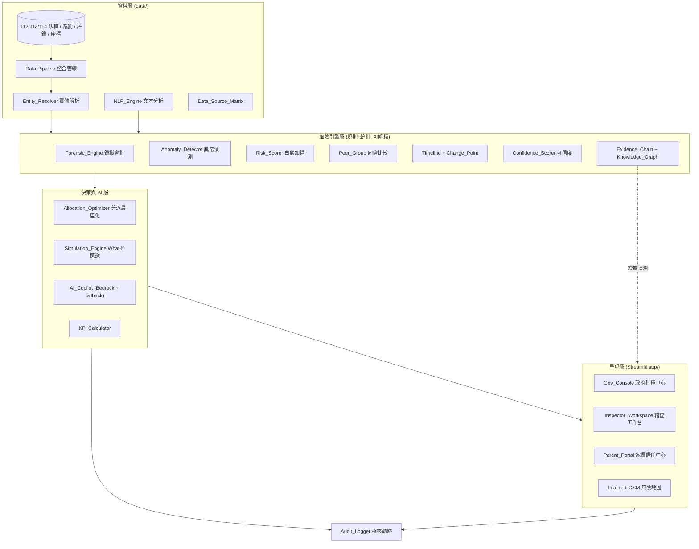
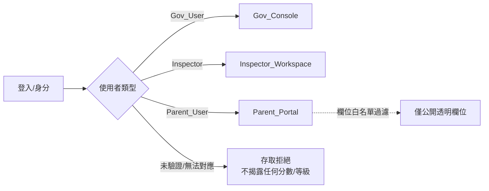

# Design Document

小小守護員 Smart Watchdog Platform — AI 稽查官設計文件

---

## Overview

本設計文件將 `requirements.md`（24 則需求、P0/P1/P2 三級優先）轉譯為可實作的技術設計，並嚴格建立於既有基線（`src/forensic.py`、`src/risk_score.py`、`src/ai_report.py`、`app/`）之上——**延伸而非重寫**。

### 設計定位（三大差異化武器，貫穿全文件）

1. **鑑識會計護城河**：風險分數由**規則與統計**（班佛定律 MAD + 卡方、Beneish 改良版、Isolation Forest + SHAP、IQR 離群、跨年度突變、同儕 z-score）計算，**AI 不參與計分**。這是可解釋性的根基。
2. **可解釋白盒子分數**：0–100 總分可攤開為 財務異常 / 裁罰 / 評鑑 /（預留）輿情 四分項，各有明確權重，以雷達圖呈現，並附各分項貢獻明細。**禁止黑盒**。
3. **生成式 AI（AWS Bedrock）產出稽查報告與建議**：Bedrock 只負責「把數字翻譯成稽查員看得懂的話 + 給稽查方向」，並具規則式 fallback 確保 Demo 可跑。

### 責任 AI 原則（Responsible AI，設計層強制）

系統輸出僅限五類：**發現異常、排序、解釋、提供證據、建議稽查方向**。系統**不得**判定犯罪、舞弊或違法，**不得**僅以單一訊號為機構貼標籤。所有面向使用者的風險陳述都必須附帶「風險不等於違法」聲明。此原則在資料模型（`ResponsibleAINotice`）、AI 提示詞（負向約束）與家長入口（隱藏分數）三處落實。

### 30 小時決賽策略對齊

設計以 P0 需求為「可 Demo 骨幹」，P1 為加分延伸，P2 以文件交付。既有 `kindergartens_latest.csv` / `kindergartens.csv` 契約檔維持不變，作為三種使用者介面的共同資料源，確保現有 Streamlit 頁面不被破壞。

### 需求覆蓋對照

| 分類 | 需求 | 設計落點 |
|------|------|----------|
| 使用者模式 | R1, R2, R5, R6 | 使用者模式與三入口（Gov/Inspector/Parent）|
| 風險引擎 | R7, R8, R10, R12, R13, R18 | Risk Engine（延伸 forensic.py / risk_score.py）|
| 可解釋與證據 | R11, R14, R19 | Evidence Chain + Knowledge Graph + Responsible AI |
| AI 助手 | R15 | AI Copilot（延伸 ai_report.py）|
| NLP | R9 | NLP Engine |
| 決策工具 | R3, R4, R23 | Allocation Optimizer + Simulation Engine + KPI |
| 資料層 | R16, R17 | Data Pipeline + Entity Resolver + Data Source Matrix |
| 治理 | R20, R21 | HITL Feedback + Audit Logger |
| 文件 | R22, R24 | 交付文件（設計附錄，非程式碼）|

---

## Architecture

### 分層架構

系統採四層，資料由下往上流動；AI 僅存在於「呈現/建議」層，不回流影響計分層，以保證白盒可解釋性。



### 資料流原則

- **計分資料流（可解釋）**：`RAW → Pipeline → Forensic/Anomaly → Scorer → kindergartens_latest.csv`。全程規則與統計，無 AI。
- **AI 資料流（不回流）**：`kindergartens_latest.csv → Copilot/Report (Bedrock) → 呈現`。AI 讀取已算好的分數與指標，僅產生文字，不寫回分數欄位。
- **證據資料流（可追溯）**：每一風險結論 → 特徵歸因（SHAP/規則）→ 原始資料值 → 官方來源連結，形成 `Evidence_Chain`。

### 技術棧

| 面向 | 技術 | 依據 |
|------|------|------|
| 語言/計算 | Python 3, pandas, numpy, scipy, scikit-learn | 既有基線 |
| 可解釋 AI | SHAP（Isolation Forest 歸因）| R11.5 |
| 生成式 AI | AWS Bedrock（Claude）+ 規則式 fallback | 競賽限制、R15 |
| UI | Streamlit multipage（`app/`）| 既有基線 |
| 地圖 | Leaflet + OpenStreetMap，Nominatim geocoding | project-vision 技術決策、R2.4 |
| 最佳化 | 貪婪/背包法（可行時），確定性排序 tie-break | R3 |
| 測試 | pytest + Hypothesis（property-based）| 解析器/序列化附註 |

### 使用者模式與存取控制（R1, R19）

三種模式互斥，功能集合不重疊。以「模式路由 + 欄位白名單」實作：



Parent_Portal 透過 `public_view()` 白名單投影，從資料集移除 `risk_total`、`risk_level`、所有 `score_*` 與其衍生排序欄位後才呈現，確保無法還原分數（R1.5, R6.6）。

---

## Components and Interfaces

以下元件標示 **[延伸現有]** 或 **[淨新增]**，並列出關鍵介面簽章（Python 型別提示為主）。

### 1. Forensic_Engine [延伸現有 — `src/forensic.py`]

保留既有 `benford_mad`、`benford_chi_square`、`beneish_lite`、`isolation_forest_scores`、`flag_outliers`、`yoy_change`、`analyze`。新增明確公式指標（R7.1–R7.5, R7.9）與缺值保護（R7.11）。

```python
def compute_metrics(row: dict, peer_stats: PeerStats) -> ForensicMetrics:
    """計算 R7.1 六項指標 + 支出結構占比(R7.3) + YoY(R7.4) + 同儕 z/百分位(R7.5)。
    小數點後 4 位輸出；分母為 0/缺值時該指標標記 uncomputable(R7.11)。"""

def sudden_change_flag(yoy_rate: float, threshold: float = 0.30) -> bool:
    """|YoY| >= threshold 標記突變；threshold 可設定範圍 0.01–5.00 (R7.6)。"""
```

`ForensicMetrics` 每一指標附 `formula: str`（R7.9）。既有四層方法（班佛 MAD+卡方、Beneish、Isolation Forest、IQR）維持（R7.10, R8.6）。

### 2. Anomaly_Detector [延伸現有]

保留 Isolation Forest 與 IQR；補齊點/情境/集體三類旗標與多方法一致性（R8.1–R8.5）。

```python
def detect(entity: EntityData, methods: list[str]) -> AnomalyResult:
    """對 point/contextual/collective 各輸出 (bool flag, score)。
    每方法輸出 score + threshold 導出的 flag(R8.2)。
    樣本不足時該方法標記 insufficient_sample 並跳過，不中斷其餘(R8.5)。"""

def method_applicability(method: str) -> MethodNote:
    """回傳適用異常類型、資料前提、已知限制(R8.3)。"""

def consolidate(results: list[AnomalyMethodResult]) -> ConsolidatedAnomaly:
    """>=2 方法命中 → 'high_confidence' 並記命中數；單一方法 → 'to_confirm'(R8.4)。"""
```

### 3. Risk_Scorer [延伸現有 — `src/risk_score.py`]

保留白盒加權（financial 0.50 + penalty 0.34 + eval 0.16）、`risk_level_percentile`、`risk_level_absolute`、`build`。強化：分項貢獻明細（R10.3）、缺資料以中性值處理不放大（R10.5, R18.2）、風險不等於違法標示（R10.4, R19.4）。

```python
def score(entity: EntityData, weights: Weights, confidence: float) -> RiskBreakdown:
    """輸出 total(0-100) + 各分項貢獻明細 + level(低/中/高/極高)。
    加權後分項總和 == total (R5.2)。
    缺資料分項以中性值代入(R10.5)；低可信度不得單獨推高(R18.2)。"""
```

`RiskBreakdown.contributions` 為 `dict[str, float]`，`sum(contributions.values()) == total`（供雷達圖與可解釋展示，R5.2, R10.3）。

### 4. Peer_Group / 同儕比較 [延伸現有]

```python
def build_peer_group(entity, population, by=("park_type","size_band","district")) -> PeerGroup: ...
def peer_stats(entity, group) -> PeerComparison:
    """中位數/百分位/z-score/穩健偏差(R13.2)；樣本 < 門檻標記 insufficient(R13.4)。"""
```

### 5. Timeline + Change_Point [淨新增]

```python
def build_timeline(entity_years: list[YearRecord]) -> RiskTimeline:
    """跨年度風險時間軸，年度由舊到新排序(R5.3, R12.1)。"""
def detect_change_points(series: list[float]) -> list[ChangePoint]:
    """統計顯著變化點；每點附觸發指標說明(R12.2–R12.4)。"""
```

### 6. NLP_Engine [淨新增]

```python
def analyze_text(text: str, doc_type: str) -> NLPResult:
    """分類、違規類型與嚴重度、關鍵字/主題、事件摘要與時間軸(R9.1–R9.4)。
    依 Risk_Taxonomy 歸類；無法歸類 → '其他' 並保留原文供人工判讀(R9.5, R9.6)。"""
```

### 7. Confidence_Scorer [淨新增]

```python
def confidence(record: EntityData) -> DataConfidence:
    """0–100 資料可信度(R18.1)；供 Scorer 抑制低可信度推高(R18.2)、供介面併同顯示(R18.3)。"""
```

### 8. Evidence_Chain + Knowledge_Graph [延伸現有 SHAP + 淨新增]

```python
def build_evidence_chain(conclusion: RiskConclusion) -> EvidenceChain:
    """結論 → 特徵歸因 → 原始資料值 → 官方來源，每一環可追溯(R11.1–R11.5)。"""
def build_knowledge_graph(signals: list[Signal]) -> KnowledgeGraph:
    """訊號 → 類別 → 風險節點與關係；每風險節點可回溯來源訊號(R14)。"""
```

### 9. AI_Copilot / Report_Generator [延伸現有 — `src/ai_report.py`]

保留 `build_prompt`、`generate_with_bedrock`、`generate_fallback`、`generate_report`。強化提示詞負向約束（不宣稱違法/舞弊 R15.3, R19.2）、資料不足告知（R15.4）、關鍵陳述附來源（R15.2）、Bedrock 不可用退化 fallback（R15.5）。

```python
def answer(question: str, entity: EntityData) -> CopilotAnswer:
    """以該機構資料為依據回答(R15.1)；關鍵陳述附來源(R15.2)；
    資料不足明確告知不杜撰(R15.4)；避免違法/舞弊宣稱(R15.3)。"""
```

### 10. Allocation_Optimizer [淨新增]

```python
def optimize(institutions: list[Institution], n: int,
             region_filter: RegionFilter, inspected: set[str],
             policy: Policy) -> AllocationResult:
    """在限制下最大化所選機構風險分數總和(R3.2)；輸出 <= N 且盡量多(R3.6)；
    排除已稽查(R3.4)、滿足區域限制(R3.5)；
    多最佳解 → 依 (風險分 desc, park_id asc) 確定性選取(R3.3)；
    合格 < N → 全輸出並標示(R3.7)；無合格 → 空集合+說明(R3.8)；
    N 非 1..1000 整數 → 拒絕+錯誤訊息(R3.9)；每機構附分派理由(R3.10)。"""
```

### 11. Simulation_Engine [淨新增]

```python
def simulate(base: RiskDataset, params: SimParams) -> SimulationResult:
    """依配額(1–999)/權重方案/排除近12月已稽查重排序(R4.1–R4.3)；
    不覆寫基準分數(R4.4)；<=2 秒回傳(R4.5)；
    參數無效 → 拒絕+訊息且不變更既有顯示(R4.6)。"""
```

### 12. Data Pipeline + Entity_Resolver [淨新增]

```python
def run_pipeline(sources: DataSources) -> IntegratedDataset:
    """整合財務/裁罰/評鑑/收費/地理(R17.1)。"""
def resolve_entity(records: list[RawRecord]) -> list[ResolvedEntity]:
    """跨名稱變體/年度解析為同一實體(R17.2)；
    無法可靠判定 → 標記 pending_manual 不強制合併(R17.3)；
    每合併決策保留可追溯依據(R17.4)。"""
```

### 13. 文件解析器與序列化器 [淨新增 — 解析器附註]

R17 涉及公校決算 PDF 文字層擷取與非營利園掃描財報（OCR / Textract / Bedrock 多模態）解析為結構化財務物件。為保證正確性，設計納入 pretty printer 與 round-trip 驗證：

```python
def parse_financial_record(raw_text: str) -> FinancialRecord:
    """將原始文件文字解析為結構化財務物件。"""
def print_financial_record(record: FinancialRecord) -> str:
    """將財務物件美化輸出為標準文字表示（pretty printer）。"""
# 往返一致性：parse(print(x)) 等價於 x（見 Correctness Properties）。
```

### 14. Audit_Logger + HITL_Feedback [淨新增]

```python
def log(actor: str, action: str, target: str, ts: datetime) -> None:
    """關鍵操作（判定/分派/模擬/回饋）僅可新增不可竄改(R21.1, R21.2)。"""
def query_audit(filter: AuditFilter) -> list[AuditEntry]:
    """依時間順序回傳(R21.3)。"""
def submit_feedback(fb: HITLFeedback) -> None:
    """確為異常/誤報/資料問題/需進一步稽查；關聯機構與判定(R20)。"""
```

### 15. Data_Source_Matrix [淨新增]

以靜態設定表記錄每資料源屬性與可信度；僅列實際存在資料集，未確認標「未確認」，不虛構（R16）。

---

## Data Models

核心資料模型（以 dataclass 語意描述；實際落地為 pandas 欄位 + Python 物件）。

### FinancialRecord（解析器產物 / 財務原始物件）

```python
@dataclass
class FinancialRecord:
    park_id: str
    park_name: str
    year: int                    # 112/113/114
    income_actual: float | None
    expense_actual: float | None
    tuition_actual: float | None
    surplus: float | None
    income_last_year: float | None
    expense_last_year: float | None
    enrollment: int | None       # 招生人數
    detail_amounts: list[int]    # 逐筆明細金額（班佛用）
    source_ref: SourceRef        # 官方來源追溯
```

### ForensicMetrics（鑑識指標，R7）

```python
@dataclass
class Metric:
    name: str
    value: float | None          # 4 位小數；uncomputable 時為 None
    formula: str                 # 明確公式定義 (R7.9)
    computable: bool             # 分母 0/缺值 → False (R7.11)

@dataclass
class ForensicMetrics:
    income_growth: Metric
    expense_growth: Metric
    personnel_ratio: Metric      # 人事費/總支出
    operating_ratio: Metric      # 業務費/總支出
    income_per_child: Metric
    expense_per_child: Metric
    expense_structure: dict[str, float]  # 人事/業務/其他，合計 0.99–1.01 (R7.3)
    benford_mad: float | None
    benford_chi2: float | None
    beneish_score: float
    iforest_score: float | None
```

### AnomalyResult（R8）

```python
@dataclass
class AnomalyMethodResult:
    method: str
    score: float
    flag: bool
    applicable: bool             # 樣本足夠 (R8.5)
    note: MethodNote             # 適用類型/前提/限制 (R8.3)

@dataclass
class AnomalyResult:
    point: tuple[bool, float]
    contextual: tuple[bool, float]
    collective: tuple[bool, float]
    methods: list[AnomalyMethodResult]
    confidence_label: str        # 'high_confidence' | 'to_confirm'
    method_hit_count: int        # (R8.4)
```

### RiskBreakdown（白盒分數，R10, R5.2）

```python
@dataclass
class RiskBreakdown:
    total: float                 # 0–100
    level: str                   # 低/中/高/極高
    contributions: dict[str, float]  # financial/penalty/eval/(sentiment)
    weights: dict[str, float]    # 顯示用權重
    not_illegality_notice: str   # 風險≠違法 (R10.4, R19.4)
    data_confidence: float       # (R18.3)
    # 不變式：round(sum(contributions.values()),1) == total
```

### EvidenceChain / KnowledgeGraph（R11, R14）

```python
@dataclass
class EvidenceLink:
    conclusion: str
    feature: str                 # 特徵歸因
    raw_value: float | str       # 原始資料值
    source: SourceRef            # 官方來源

@dataclass
class SourceRef:
    dataset: str
    authority: str               # 主管機關
    url: str | None
    last_updated: date | None
```

### AllocationResult / SimParams（R3, R4）

```python
@dataclass
class AllocationItem:
    park_id: str
    risk_score: float
    reason: str                  # 分派理由 (R3.10)

@dataclass
class AllocationResult:
    selected: list[AllocationItem]   # <= N，依確定性順序
    fewer_than_n: bool               # (R3.7)
    message: str | None              # 無合格/N 無效說明 (R3.8, R3.9)

@dataclass
class SimParams:
    quota: int                       # 1–999 (R4.1)
    weight_scheme: str               # 允許清單 (R4.2)
    exclude_recent_inspected: bool   # 近12月 (R4.3)
```

### PublicInstitutionView（家長入口白名單，R6）

```python
@dataclass
class PublicInstitutionView:
    park_name: str
    ownership: str               # 公私立別
    tuition_info: dict | None
    public_eval: str | None
    public_penalty: list | None
    field_sources: dict[str, SourceRef]   # 每欄位來源+更新時間 (R6.2)
    stale_flags: dict[str, bool]           # >365 天標記 (R6.4)
    # 不含任何 risk_total / risk_level / score_* / 衍生排序 (R6.6)
```

### AuditEntry / HITLFeedback / DataConfidence

```python
@dataclass
class AuditEntry:
    actor: str; action: str; target: str; ts: datetime   # append-only (R21)

@dataclass
class HITLFeedback:
    entity_id: str; verdict_ref: str
    label: str  # 確為異常/誤報/資料問題/需進一步稽查 (R20.1)

@dataclass
class DataConfidence:
    entity_id: str
    score: float                 # 0–100 (R18.1)
    factors: dict[str, float]
```

### 契約檔（維持既有，不破壞現有 UI）

`kindergartens_latest.csv`（每園一列）與 `kindergartens.csv`（每園每年一列）維持既有欄位；新增欄位以「附加」方式加入，避免破壞 `app/lib/common.py` 的載入契約。


---

## Correctness Properties

*A property is a characteristic or behavior that should hold true across all valid executions of a system—essentially, a formal statement about what the system should do. Properties serve as the bridge between human-readable specifications and machine-verifiable correctness guarantees.*

以下屬性經過去冗餘反思（redundancy reflection）：語意等價或彼此蘊含的驗收準則已合併為單一綜合屬性（例如 R1.5+R6.6、R6.7+R15.3+R19.2、R5.2+R10.3、R10.4+R19.4、R10.5+R18.2、R5.3+R12.1）。UI 呈現、效能、純設定與文件類驗收準則不列為屬性，改由單元/整合/快照測試或文件交付涵蓋。

### Property 1: 使用者模式唯一對應

*For any* 已驗證使用者，模式解析結果恰為 Gov_Console、Inspector_Workspace、Parent_Portal 三者之一，或為「存取拒絕」；不會同時對應兩種以上模式。

**Validates: Requirements 1.1**

### Property 2: 家長入口隱藏所有內部風險資訊

*For any* 機構紀錄，家長入口的公開投影（`public_view`）輸出不包含 `risk_total`、`risk_level`、任何 `score_*` 欄位或其衍生排序，且無任何可還原上述值的欄位。

**Validates: Requirements 1.5, 6.6**

### Property 3: 功能集合互斥

*For any* 功能項目，其恰屬於三種模式集合之一；任兩模式功能集合的交集為空。

**Validates: Requirements 1.6**

### Property 4: 未授權存取不揭露分數

*For any* 未通過驗證或無法對應模式的身分，系統回傳「存取拒絕」且輸出不含任何機構風險分數或等級。

**Validates: Requirements 1.7**

### Property 5: 風險等級分級門檻

*For any* 介於 0 至 100 的風險分數，Gov_Console 分級為：分數 ≥ 70 為高、40 ≤ 分數 ≤ 69 為中、分數 < 40 為低（邊界 40 與 70 判定一致）。

**Validates: Requirements 2.2**

### Property 6: KPI 計數非負且分類完備

*For any* 機構集合，高/中/低風險計數皆為非負整數，且三者之和等於可分級機構總數。

**Validates: Requirements 2.3**

### Property 7: 地圖顏色映射確定

*For any* 風險等級，地圖標記顏色為確定映射（高→紅、中→黃、低→綠）。

**Validates: Requirements 2.4**

### Property 8: 排名排序與截斷

*For any* 機構或行政區集合，排名結果依風險分數非遞增排序，且高風險機構排名長度不超過 20。

**Validates: Requirements 2.5, 2.6**

### Property 9: 分派最佳化—風險覆蓋最大化

*For any* 機構集合與稽查員人數 N，在所有限制條件下，最佳化輸出所選機構的風險分數總和，不小於任何相同基數之其他可行選集的風險分數總和。

**Validates: Requirements 3.2**

### Property 10: 分派確定性與 tie-break

*For any* 相同輸入，分派最佳化永遠產生相同輸出；當存在多組風險總和相同的最佳解時，依（風險分數由高至低、風險分數相同時機構識別碼由小至大）順序選取。

**Validates: Requirements 3.3**

### Property 11: 分派輸出滿足所有限制

*For any* 輸入，分派輸出中的每一機構皆不在已稽查清單內、皆滿足區域限制，且輸出數量等於 min(N, 合格機構數) 且不超過 N。

**Validates: Requirements 3.4, 3.5, 3.6**

### Property 12: 分派理由完整

*For any* 分派輸出集合，每一入選機構皆附非空分派理由，且理由內容包含該機構的風險分數。

**Validates: Requirements 3.10**

### Property 13: 無效稽查員人數被拒絕

*For any* 非介於 1 至 1000 的整數之 N，分派最佳化拒絕該請求、不產生稽查集合，並回傳指出 N 無效的錯誤訊息。

**Validates: Requirements 3.9**

### Property 14: 模擬不覆寫基準分數

*For any* 基準資料集與模擬參數，執行模擬後基準風險分數與執行前完全相同（模擬結果不回寫）。

**Validates: Requirements 4.4**

### Property 15: 模擬重排序與參數效果

*For any* 有效模擬參數，模擬結果依所選權重方案排序；變更配額（1–999）改變輸出筆數；設定排除近 12 個月已稽查時，輸出不含任何近期已稽查機構。

**Validates: Requirements 4.1, 4.2, 4.3**

### Property 16: 無效模擬參數被拒絕且不變更顯示

*For any* 無效模擬參數（配額非 1–999 整數、權重方案不在允許清單），模擬被拒絕並回傳訊息，且既有顯示結果不變。

**Validates: Requirements 4.6**

### Property 17: 白盒分數可加性

*For any* 風險分數分解（RiskBreakdown），各分項加權貢獻之總和（四捨五入至一位小數）等於顯示的總風險分數。

**Validates: Requirements 5.2, 10.3**

### Property 18: 風險時間軸排序與完整

*For any* 機構之多年度紀錄，風險時間軸涵蓋所有可取得年度且依年度由舊到新排序。

**Validates: Requirements 5.3, 12.1**

### Property 19: 鑑識指標公式與精度

*For any* 有效財務資料，六項鑑識指標（收入成長率、支出成長率、人事費占比、業務費占比、每名幼兒收入、每名幼兒支出）之值等於其定義公式計算結果，並以小數點後 4 位精度輸出。

**Validates: Requirements 7.1, 7.2, 7.4**

### Property 20: 支出結構占比合計為一

*For any* 機構支出結構，人事費、業務費與其他三類占總支出比例之合計介於 0.99 至 1.01。

**Validates: Requirements 7.3**

### Property 21: 突變門檻判定

*For any* YoY 變動率與門檻值（0.01–5.00），突變旗標為真若且唯若 YoY 變動率絕對值大於等於門檻。

**Validates: Requirements 7.6**

### Property 22: 跨年度趨勢覆蓋

*For any* 機構年度資料，跨年度趨勢涵蓋至少 3 個年度；若可得年度不足 3 個，則涵蓋全部可得年度。

**Validates: Requirements 7.7**

### Property 23: 每指標具明確公式定義

*For any* 鑑識指標輸出，每一指標皆帶有非空的公式定義字串。

**Validates: Requirements 7.9**

### Property 24: 除零／缺值安全（不可計算標記）

*For any* 財務輸入（含分母為 0 或缺值：前年度值為 0、總支出為 0、招生人數為 0），計算不拋出例外，受影響指標被標記為不可計算並排除於突變判定與同儕比較之外，其餘指標仍正常計算。

**Validates: Requirements 7.11**

### Property 25: 異常旗標與分數一致

*For any* 偵測方法結果，其布林旗標為真若且唯若該方法異常分數達到其門檻。

**Validates: Requirements 8.1, 8.2**

### Property 26: 異常一致性整合

*For any* 一組獨立方法的偵測結果，當且僅當被 2 種以上方法判為異常時標示為「高可信度異常」並正確記錄命中方法數；單一方法命中時標示為「待確認異常」。

**Validates: Requirements 8.4**

### Property 27: 文本歸類落於分類體系

*For any* 輸入文本，NLP 歸類結果必為 {收費、人事、照顧、安全、行政、財務、其他} 之一；無法對應既定分類時歸為「其他」並保留原始文本。

**Validates: Requirements 9.5, 9.6**

### Property 28: 風險總分落於有效範圍

*For any* 有效輸入，融合後的風險總分介於 0 至 100（含端點）。

**Validates: Requirements 10.1**

### Property 29: 風險不等於違法聲明恆存在

*For any* 面向使用者的風險陳述輸出，皆附帶非空的「風險不等於違法」聲明。

**Validates: Requirements 10.4, 19.4**

### Property 30: 低可信度／缺資料不放大風險

*For any* 機構，當某分項缺乏真實資料時以中性值處理，其總風險分數不高於「若該分項採用最大風險值」的分數；資料可信度低於門檻的機構不會僅因低可信度資料而被判為高風險。

**Validates: Requirements 10.5, 18.2**

### Property 31: 不作違法／舞弊宣稱

*For any* 機構，家長入口輸出與 AI 稽查助手／報告輸出（含 Bedrock 與 fallback 路徑）皆不包含將該機構斷言為違法、舞弊或犯罪之陳述，亦不將機構標示為高風險／不合格。

**Validates: Requirements 6.7, 15.3, 19.2**

### Property 32: 證據鏈完整可追溯

*For any* 風險結論，其證據鏈中每一環（特徵歸因 → 原始資料值 → 官方來源）皆完整可解析：每一特徵歸因對應到具體原始值，每一原始值對應到具備主管機關／來源標示的官方來源，無懸空連結。

**Validates: Requirements 11.1, 11.2, 11.3, 11.4**

### Property 33: 知識圖譜可回溯

*For any* 由訊號建構的風險知識圖譜，每一風險節點皆存在一條路徑回溯至至少一個來源訊號節點。

**Validates: Requirements 14.1, 14.2, 14.3**

### Property 34: 資料時效門檻標記

*For any* 欄位的官方資料最後更新時間，「資料可能過時」提示為真若且唯若距今超過 365 天。

**Validates: Requirements 6.4**

### Property 35: 同儕統計量正確

*For any* 同儕群組，機構相對群組之百分位介於 0 至 100，z-score 等於 (x − 群組平均) / 群組標準差，中位數與參考實作一致。

**Validates: Requirements 13.2**

### Property 36: 變化點標記與說明

*For any* 時間序列，被標記的變化點恰為滿足變化點判定條件者，且每一標記變化點皆附對應的觸發指標說明。

**Validates: Requirements 12.2, 12.3, 12.4**

### Property 37: 資料可信度落於有效範圍

*For any* 機構或資料紀錄，其資料可信度分數介於 0 至 100（含端點）。

**Validates: Requirements 18.1**

### Property 38: 實體解析一致且冪等

*For any* 同一機構的一組名稱變體與跨年度紀錄，實體解析將其指派至相同的機構實體識別碼；對同一輸入重複解析結果不變（冪等），且每一次合併決策皆保留可追溯依據。

**Validates: Requirements 17.2, 17.4**

### Property 39: 財務文件解析往返一致

*For any* 有效財務物件 x，`parse(print(x))` 產生與 x 等價的財務物件；且 `print(parse(print(x))) == print(x)`（美化輸出穩定）。

解析器與序列化附註（Parser & Serializer Note）之 round-trip 驗證。

**Validates: Requirements 17.1**

### Property 40: 稽核軌跡僅可新增

*For any* 稽核操作序列，任一既有稽核紀錄在後續操作後皆未被竄改，且稽核紀錄總數單調遞增。

**Validates: Requirements 21.1, 21.2**

### Property 41: 稽核軌跡時間排序

*For any* 已記錄的稽核序列，查詢回傳的紀錄依時間戳非遞減排序。

**Validates: Requirements 21.3**

### Property 42: KPI 計算落於定義範圍

*For any* 帶標籤資料集與 K，Precision@K 與 Recall@K 介於 0 至 1，且與其定義一致；資料整合覆蓋率、可解釋性覆蓋率、來源可追溯率等比率型 KPI 介於 0 至 1。

**Validates: Requirements 23.1**

### Property 43: AI 報告 fallback 保底

*For any* 機構，當 Bedrock 不可用時，`generate_report` 回傳非空報告文字且來源標示為 `fallback`。

**Validates: Requirements 15.5**

---

## Error Handling

錯誤處理遵循「不中斷、可解釋、誠實揭露」三原則，並涵蓋 prework 中歸為 EDGE_CASE 的驗收準則。

### 資料與計算層

| 情境 | 處理 | 需求 |
|------|------|------|
| 分母為 0／缺值（前年度值 0、總支出 0、招生人數 0）| 該指標標記 `computable=False`，排除於突變判定與同儕比較，不拋例外，其餘指標續算 | R7.11 |
| 方法樣本不足 | 標記 `insufficient_sample` 並跳過該方法，不中斷其餘方法 | R8.5, R13.4 |
| 分項缺乏真實資料 | 以中性值代入（非佔位值放大），並降低該機構資料可信度 | R10.5, R18.2 |
| 文本無法歸類 | 歸為「其他」並保留原文供人工判讀 | R9.6 |
| 實體歸屬無法可靠判定 | 標記 `pending_manual`，不強制合併 | R17.3 |

### 決策層

| 情境 | 處理 | 需求 |
|------|------|------|
| 分派 N 無效（非 1–1000 整數）| 拒絕請求、不產生集合、回傳錯誤訊息 | R3.9 |
| 合格機構 < N | 輸出全部合格機構並標示 `fewer_than_n=True` | R3.7 |
| 無合格機構 | 回傳空集合並附無合格原因說明 | R3.8 |
| 模擬參數無效 | 拒絕模擬、回傳訊息、既有顯示結果不變 | R4.6 |

### AI 層

| 情境 | 處理 | 需求 |
|------|------|------|
| Bedrock 不可用／呼叫失敗 | 退化為規則式 fallback，回傳非空報告並標示來源 `fallback`，附失敗原因註記 | R15.5 |
| 資料不足以回答 | AI_Copilot 明確告知資料不足，不杜撰 | R15.4 |
| 輸出含違法/舞弊字樣風險 | 提示詞負向約束 + 輸出後過濾，移除違法/舞弊斷言 | R15.3, R19.2 |

### 呈現層（Inspector_Workspace / Gov_Console / Parent_Portal）

| 情境 | 處理 | 需求 |
|------|------|------|
| 某分析類別無資料 | 顯示「無資料」狀態，而非空白或錯誤 | R5.12 |
| 工作台資料載入失敗 | 顯示載入失敗訊息 + 重新載入操作，不覆寫既有已顯示資料 | R5.13 |
| 原始來源連結無法開啟 | 顯示該來源無法存取提示，其餘內容維持可操作 | R5.14 |
| 地圖標記缺分數/訊號 | 顯示機構名稱並標示「資料尚未提供」 | R2.10 |
| 家長入口欄位無官方資料 | 標示「查無公開資料」，不以推估/預設/空白替代 | R6.3 |

---

## Testing Strategy

採**雙軌測試**：單元/整合測試涵蓋具體範例、邊界與錯誤條件；屬性測試涵蓋跨輸入的普遍正確性。本功能的核心計算層（鑑識指標、白盒評分、分派最佳化、同儕統計、實體解析、財務文件解析器）具備明確的「for all inputs」性質，**適用 property-based testing**；UI 呈現、地圖渲染、Streamlit 頁面互動、資料來源矩陣與 P2 文件交付則以單元／整合／快照測試與文件交付涵蓋。

### Property-Based Testing（屬性測試）

- **函式庫**：採用 [Hypothesis](https://hypothesis.readthedocs.io/)（Python），不自行實作屬性測試框架。
- **迭代次數**：每個屬性測試至少執行 100 次迭代（`@settings(max_examples=100)` 或更高）。
- **對應關係**：每個 Correctness Property 以**單一**屬性測試實作。
- **標籤格式**：每個屬性測試以註解標註 `Feature: smart-watchdog-platform, Property {number}: {property_text}`。
- **產生器（generators）需涵蓋的邊界**（吸收 EDGE_CASE 準則）：
  - 財務金額含 0、負數（短絀）、缺值（None）、極大值、跨數量級（班佛用）。
  - 分母為 0／缺值情境（R7.11）；樣本數低於方法門檻（R8.5, R13.4）。
  - 機構名稱變體（全形/半形、空白、年度後綴）供實體解析（R17.2）。
  - 財務物件 round-trip 產生器涵蓋特殊字元、編碼、空欄位（解析器附註）。
  - 分派 N 的無效值（0、負、>1000、非整數）與有效邊界（1、1000）（R3.9）。
  - 資料時效邊界（恰 365 天、366 天）（R6.4）。
- **重點屬性**：Property 39（財務文件解析往返一致）為解析器/序列化器的必備 round-trip 測試；Property 9/10（分派最佳化）對小輸入以暴力法作為 model-based 參考實作驗證最佳性與 tie-break。

### 單元測試（Unit Tests）

聚焦具體範例與整合點：
- 各角色預設進入畫面內容（R1.2–R1.4）、雷達圖分項渲染、檢核清單勾選（R5.9）。
- Gov_Console 總覽/趨勢/熱點聚合（R2.1, R2.7, R2.8）、標記點選明細（R2.9）。
- NLP 分類/摘要/時間軸的具體案例（R9.1–R9.4）、Copilot 以資料為依據回答與附來源（R15.1, R15.2）。
- 錯誤處理路徑（R5.12–R5.14, R2.10, R6.3）以具體案例驗證。
- 保留既有方法回歸測試：班佛/Beneish/IForest/IQR/SHAP/百分位分級仍運作（R7.10, R8.6, R10.6, R11.5, R15.6）。

### 整合測試（Integration Tests，1–3 範例）

- 資料整合管線端到端：由 `data/` 原始資料跑至 `kindergartens_latest.csv`（R17.1）。
- Bedrock 呼叫路徑（有金鑰時）1 個範例 + fallback 路徑（無金鑰時）1 個範例（R15.5）。
- HITL 回饋寫入與關聯、稽核軌跡查詢（R20, R21）。

### Smoke / 設定與文件檢查

- 資料來源矩陣欄位完整性與「未確認」標記（R16）—單次檢查。
- 效能觀察：模擬回應 < 2 秒（R4.5）、工作台載入 < 3 秒（R5.1）—以代表性案例量測，非屬性測試。
- P2 文件交付（R22, R24）與評估指標/標註策略以文件形式驗收。

### 責任 AI 測試（貫穿）

Property 2、4、29、31 專門驗證責任 AI 邊界：家長入口不洩分數、未授權不揭露、風險≠違法聲明恆存、不作違法/舞弊宣稱。此四項為 Demo 前必過項目。
